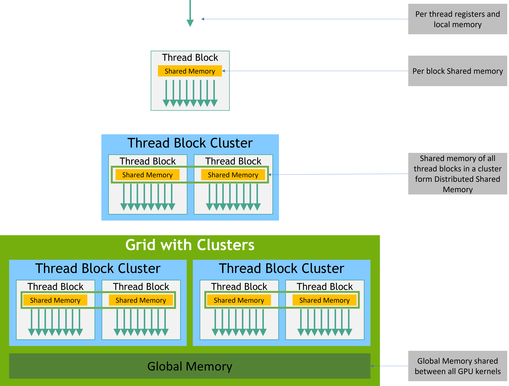

# Программирование на Cuda

https://docs.nvidia.com/cuda/cuda-c-programming-guide/index.html#c-language-extensions

https://nvidia.github.io/libcudacxx/extended_api

## Синтаксис
Для исполнения кернела надо его вызвать:
```cpp
// Kernel definition
__global__ void VecAdd(float* A, float* B, float* C)
{
    int i = threadIdx.x;
    C[i] = A[i] + B[i];
}

int main()
{
    ...
    // Kernel invocation with N threads
    VecAdd<<<1, N>>>(A, B, C);
    ...
}
```

Каждый индекс - массив из 3 чисел, отвечающих 3 независимым осям.
```cpp
// Kernel definition
__global__ void MatAdd(float A[N][N], float B[N][N],
                       float C[N][N])
{
    int i = threadIdx.x;
    int j = threadIdx.y;
    C[i][j] = A[i][j] + B[i][j];
}

int main()
{
    ...
    // Kernel invocation with one block of N * N * 1 threads
    int numBlocks = 1;
    dim3 threadsPerBlock(N, N);
    MatAdd<<<numBlocks, threadsPerBlock>>>(A, B, C);
    ...
}
```

Индексация тредов производится внутри `thread block`. 
Он исполняется на одном мультипроцессорном ядре, поэтому количество тредов в блоке ограничено 1024.

Блоки также индексируются с помощью 3 чисел:

```cpp
// Kernel definition
__global__ void MatAdd(float A[N][N], float B[N][N],
float C[N][N])
{
    int i = blockIdx.x * blockDim.x + threadIdx.x;
    int j = blockIdx.y * blockDim.y + threadIdx.y;
    if (i < N && j < N)
        C[i][j] = A[i][j] + B[i][j];
}

int main()
{
    ...
    // Kernel invocation
    dim3 threadsPerBlock(16, 16);
    dim3 numBlocks(N / threadsPerBlock.x, N / threadsPerBlock.y);
    MatAdd<<<numBlocks, threadsPerBlock>>>(A, B, C);
    ...
}
```

Блоки могут исполняться в любом порядке в то время как треды могут быть синхронизированы `__syncthreads()`.

Есть еще и кластеры, слстоящие из блоков.

Каждый тред имеет локальную память. 
Каждый блок тредов имеет разделяемую память. 
Каждый блок из кластера может смотреть в разделяемую память других блоков.

Все треды разделяют общую память разделенную на несколько типов:
`global`, `constant`, `texture`


Помимо этого существует `unified memory`б которая видна с любого девайса на котором исполняется гетерогенная программа.

Синхронизация проводитяс с помощтю объектов `cuda::barrier`, `cude::pipeline`.
Для них можно подобрать разные скоупы внутри которых проводится синхронизация.


### Рантайм
- инициализация проводится с помощью `cudaInitDevice()`, `cudaSetDevice()`. 
Без этих вызовов инициализируется нулевой девайс.
При вызове `cudaDeviceReset()` контекст уничтожается.

- Можно создавать линейную память и `CudaArray`.
Для создания и освобождения линейной памяти на девайсе надо вызвать `cudaMalloc()`, `cudaFree()`.
Для перемещения памяти между хостом и девайсом используется `cudaMemcoy()`.
```cpp
// Device code
__global__ void VecAdd(float* A, float* B, float* C, int N)
{
    int i = blockDim.x * blockIdx.x + threadIdx.x;
    if (i < N)
        C[i] = A[i] + B[i];
}

// Host code
int main()
{
    int N = ...;
    size_t size = N * sizeof(float);

    // Allocate input vectors h_A and h_B in host memory
    float* h_A = (float*)malloc(size);
    float* h_B = (float*)malloc(size);
    float* h_C = (float*)malloc(size);

    // Initialize input vectors
    ...

    // Allocate vectors in device memory
    float* d_A;
    cudaMalloc(&d_A, size);
    float* d_B;
    cudaMalloc(&d_B, size);
    float* d_C;
    cudaMalloc(&d_C, size);

    // Copy vectors from host memory to device memory
    cudaMemcpy(d_A, h_A, size, cudaMemcpyHostToDevice);
    cudaMemcpy(d_B, h_B, size, cudaMemcpyHostToDevice);

    // Invoke kernel
    int threadsPerBlock = 256;
    int blocksPerGrid =
            (N + threadsPerBlock - 1) / threadsPerBlock;
    VecAdd<<<blocksPerGrid, threadsPerBlock>>>(d_A, d_B, d_C, N);

    // Copy result from device memory to host memory
    // h_C contains the result in host memory
    cudaMemcpy(h_C, d_C, size, cudaMemcpyDeviceToHost);

    // Free device memory
    cudaFree(d_A);
    cudaFree(d_B);
    cudaFree(d_C);

    // Free host memory
    ...
}
```
Работа с двумерными массивами:
```cpp
// Host code
int width = 64, height = 64;
float* devPtr;
size_t pitch;
cudaMallocPitch(&devPtr, &pitch,
                width * sizeof(float), height);
MyKernel<<<100, 512>>>(devPtr, pitch, width, height);

// Device code
__global__ void MyKernel(float* devPtr,
                         size_t pitch, int width, int height)
{
    for (int r = 0; r < height; ++r) {
        float* row = (float*)((char*)devPtr + r * pitch);
        for (int c = 0; c < width; ++c) {
            float element = row[c];
        }
    }
}
```

### Перемножение матриц на глобальной памяти
```cpp

// Matrices are stored in row-major order:
// M(row, col) = *(M.elements + row * M.width + col)
typedef struct {
    int width;
    int height;
    float* elements;
} Matrix;

// Thread block size
#define BlockSize 16

// Forward declaration of the matrix multiplication kernel
__global__ void MatMulKernel(const Matrix, const Matrix, Matrix);

// Matrix multiplication - Host code
// Matrix dimensions are assumed to be multiples of BlockSize
void MatMul(const Matrix A, const Matrix B, Matrix C)
{
    // Load A and B to device memory
    Matrix d_A;
    d_A.width = A.width; d_A.height = A.height;
    size_t size = A.width * A.height * sizeof(float);
    cudaMalloc(&d_A.elements, size);
    cudaMemcpy(d_A.elements, A.elements, size,
               cudaMemcpyHostToDevice);
    Matrix d_B;
    d_B.width = B.width; d_B.height = B.height;
    size = B.width * B.height * sizeof(float);
    cudaMalloc(&d_B.elements, size);
    cudaMemcpy(d_B.elements, B.elements, size,
               cudaMemcpyHostToDevice);

    // Allocate C in device memory
    Matrix d_C;
    d_C.width = C.width; d_C.height = C.height;
    size = C.width * C.height * sizeof(float);
    cudaMalloc(&d_C.elements, size);

    // Invoke kernel
    dim3 dimBlock(BlockSize, BlockSize);
    dim3 dimGrid(B.width / dimBlock.x, A.height / dimBlock.y);
    MatMulKernel<<<dimGrid, dimBlock>>>(d_A, d_B, d_C);

    // Read C from device memory
    cudaMemcpy(C.elements, d_C.elements, size,
               cudaMemcpyDeviceToHost);

    // Free device memory
    cudaFree(d_A.elements);
    cudaFree(d_B.elements);
    cudaFree(d_C.elements);
}

// Matrix multiplication kernel called by MatMul()
__global__ void MatMulKernel(Matrix A, Matrix B, Matrix C)
{
    // Each thread computes one element of C
    // by accumulating results into Cvalue
    float Cvalue = 0;
    int row = blockIdx.y * blockDim.y + threadIdx.y;
    int col = blockIdx.x * blockDim.x + threadIdx.x;
    for (int e = 0; e < A.width; ++e)
        Cvalue += A.elements[row * A.width + e]
                * B.elements[e * B.width + col];
    C.elements[row * C.width + col] = Cvalue;
}
```
(При вызове кернела не было определен размер кластера тк блоки не читают локальную память)

Перемножение матриц с использованием `shared memory` производится блочно:


Поскольку локальная память ограничина, в каждом блоке матрицы разбиваются на квадратные с размером `block_size`.

###  Distributed shared memory
Существует адресное пространство к которому могу тобращаться все блоки, находящиеся в одном кластере.
При обращении к этим адресам необходимо чтобы все блоки существовали.

Пример подсчета гистограммы:
```cpp
#include <cooperative_groups.h>

// Distributed Shared memory histogram kernel
__global__ void clusterHist_kernel(int *bins, const int nbins, const int bins_per_block, const int *__restrict__ input,
                                   size_t array_size)
{
  extern __shared__ int smem[];
  namespace cg = cooperative_groups;
  int tid = cg::this_grid().thread_rank();

  // Cluster initialization, size and calculating local bin offsets.
  cg::cluster_group cluster = cg::this_cluster();
  unsigned int clusterBlockRank = cluster.block_rank();
  int cluster_size = cluster.dim_blocks().x;

  for (int i = threadIdx.x; i < bins_per_block; i += blockDim.x)
  {
    smem[i] = 0; //Initialize shared memory histogram to zeros
  }

  // cluster synchronization ensures that shared memory is initialized to zero in
  // all thread blocks in the cluster. It also ensures that all thread blocks
  // have started executing and they exist concurrently.
  cluster.sync();

  for (int i = tid; i < array_size; i += blockDim.x * gridDim.x)
  {
    int ldata = input[i];

    //Find the right histogram bin.
    int binid = ldata;
    if (ldata < 0)
      binid = 0;
    else if (ldata >= nbins)
      binid = nbins - 1;

    //Find destination block rank and offset for computing
    //distributed shared memory histogram
    int dst_block_rank = (int)(binid / bins_per_block);
    int dst_offset = binid % bins_per_block;

    //Pointer to target block shared memory
    int *dst_smem = cluster.map_shared_rank(smem, dst_block_rank);

    //Perform atomic update of the histogram bin
    atomicAdd(dst_smem + dst_offset, 1);
  }

  // cluster synchronization is required to ensure all distributed shared
  // memory operations are completed and no thread block exits while
  // other thread blocks are still accessing distributed shared memory
  cluster.sync();

  // Perform global memory histogram, using the local distributed memory histogram
  int *lbins = bins + cluster.block_rank() * bins_per_block;
  for (int i = threadIdx.x; i < bins_per_block; i += blockDim.x)
  {
    atomicAdd(&lbins[i], smem[i]);
  }
}
```
(Поскольку количество значений в гистограмме может быть больше чем размер локальной памяти, 
для записи значения используется `distributed shared memory`)

### Конкурентное исполнение
Есть поддержка исполнения многих кернелов асинхронно.
Для этого можно построить граф зависимостей, который будет потом спланирован.

## С++ расширение
Для опреждления кернела используется `__device__` спецификатор.

`__global__` - определения кернела. Такой кернел может быть вызван из другого кернела. 

Определение переменных:
- `__device__` - глобальная переменная, которая доступна всем тредам в контексте (и хосту)
- `__constant__` - константная переменная, которая доступна всем тредам в контексте (и хосту)
- `__shared__` - доступна только из тредов внутри блока; имеет время жизни блока и не имеет постоянного адреса(поэтому надо обращаться через [])
```cpp
extern __shared__ float array[];
__device__ void func()      // __device__ or __global__ function
{
    short* array0 = (short*)array;
    float* array1 = (float*)&array0[128];
    int*   array2 =   (int*)&array1[64];
}
```
(тут важно выравнивание)
- `__grid_constant__` - константный объект внутри сетки из блоков
- `__managed__` - переменная доступна по адресу как из девайса так и из хоста

### Vector types
Существуют встроенные векторнные типы:
```cpp
int2 make_int2(int x, int y); //vector may be accessed with (x,y)\
```

Существуют встроенные переменные:
- `gridDim` - (dim3) размерность сетки блоков
- `blockIdx` - (uint3) индекс блока в сетке
- `blockDim` - (dim3) размеры блока по осям
- `threadIdx` - (uint3) индекс треда в блоке

### Синхронизация
- `void __syncthreads()` - барьер для всех тредов в блоке
- `int __syncthreads_count(int predicate)` - идентичный прошлому, но возвращает количество тредов для которых `predicate` не ноль

Любое обращение к памяти без синхронизации это УБ.
Надо либо использовать атомики либо синхронизацию.

### Построение программы
Каждый кернел должен выполнять одну нераспараллеливаемую задачу тк таким образом можно добиться расширяемости.

В каждом тред блоке должно быть количество тредов равно степени двойки. 
Количество тред блоков ограничено только параметрами видеокарты. 
Если матрицы больше этих лимитов, то надо менять логику программы.

### Не все функции поддержаны в куде
Например агрегатная инициализация не поддержина в куде

### Кернелы падают без сигфолта
ПОТОМУ ЧТО НЕ НАДО ПЕРЕДАВАТЬ В КЕРНЕЛ ССЫЛКУ

## Параметры моего комптютера:
```
Parameters of the device:
	Global memory size: 6225002496
	Shared memory size (per block): 49152
	Constant memory size: 65536
	Regs per blocK: 65536
	Max threads per block: 1024
	Max threads dim: {1024, 1024, 64}
	Max grid dim: {2147483647, 65535, 65535}
	Clock rate: 1590000
```

Если взять размер матрицы слишком большим, то она будет неправильно считаться.
Пример: `./MatMul --matrix 199000 2 3 --check --params`. 
Куда не выводит ошибок при превышении размера.


## Как обрабатываются ошибки в кернеле???
Надо вызывать обработчик после запуска кернелов.
Деление на 0 особо не обрабатывается. ????????