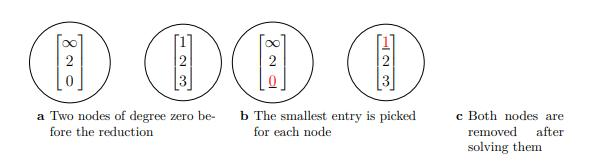

# PBQP algorithm

## Run tests
Build
```bash
mkdir build
cd build
cmake ..
make
```

Run performance:
```bash
./Perf-measure (--use-GPU/--use-CPU/--use-heuristic) --in-file file-with-graph --out-file file-to-dump --check-solution
```

## Reduction pass
All reductions accepts `GPUResult` class with GPU graph and `Solution` class. 
They also returns the same class, but with extended solution.
If reduction changes graph, it edits only adjustment matrix without changing its size.
In order to remove empty nodes `Cleanup` pass should be run.

### Cleanup pass
This pass finds nodes which have -1 in a AdjMatrix[i][i] cell and removes them.

### R0 reduction
Finds nodes without neighbors and removes them adding best cost to the silution.


## GPU evaluation
```bash
nvprof ./program
```

## Print graph
```bash
./Graph-print --in-file file-with-graph --out-file file-to-dump --LLVM
```

# Examples
```bash
./Graph-print --in-file ../tests/llvm/hello.ll.main.0.pbqpgraph --out-file out.dot --LLVM
./Perf-measure --use-heuristic --in-file ../tests/llvm/hello.ll.main.0.pbqpgraph --out-file hello-llvm-solution.out --LLVM --check-solution
/usr/local/cuda/bin/compute-sanitizer --tool memcheck  ./programm
```